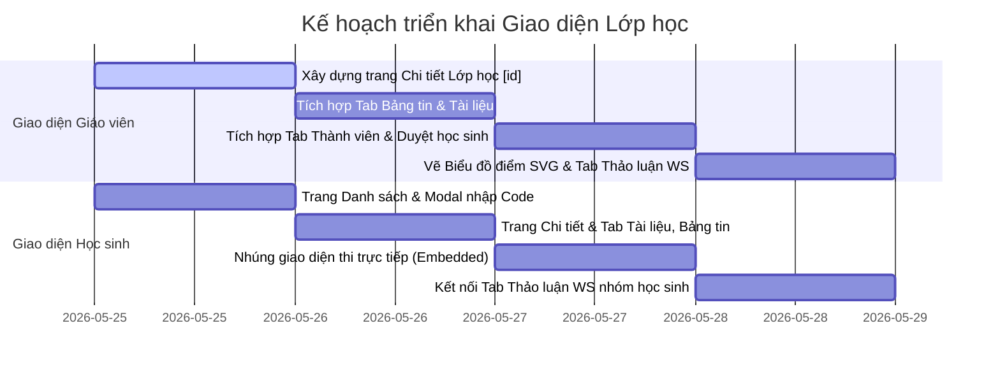

# Kế hoạch chi tiết Giao diện Lớp Học (Classroom Pages Layout Plan) - AuraAcademic

> **Bản kế hoạch chi tiết thiết kế định tuyến (Routing), bố cục các trang (Layouts) và các Tab chức năng cho từng Vai trò (Giáo viên & Học sinh) trong phân hệ Lớp học.**

---

## 🗺️ ĐỊNH TUYẾN & DANH SÁCH FILE CẦN TẠO

Hệ thống Next.js App Router sẽ sử dụng cấu trúc đa ngôn ngữ (`[locale]`) hiện tại:

```
src/app/[locale]/
├── teacher/
│   └── classrooms/
│       ├── page.tsx                 # [Đã tạo] Danh sách lớp của Giáo viên
│       └── [id]/
│           └── page.tsx             # [Cần tạo] Chi tiết lớp của Giáo viên (Bảng tin, Thành viên, Tài liệu, Bảng điểm, Thảo luận)
└── student/
    └── classrooms/
        ├── page.tsx                 # [Cần tạo] Danh sách lớp của Học sinh (Có Modal Join Class)
        └── [id]/
            └── page.tsx             # [Cần tạo] Chi tiết lớp của Học sinh (Dòng thời gian, Tài liệu, Bài thi nhúng trực tiếp, Thảo luận)
```

---

## 🧑‍🏫 1. CHI TIẾT LỚP HỌC CHO GIÁO VIÊN (`/teacher/classrooms/[id]`)

Giao diện sử dụng hệ thống Tab hiện đại, mượt mà với hiệu ứng kính mờ (Glassmorphism):
1. **Bảng tin (Stream)**: 
   * Đăng thông báo, ghim bài viết lên đầu trang.
   * Giao bài viết mới đính kèm liên kết tài liệu/bài thi.
2. **Tài liệu (Materials)**:
   * Danh sách tài liệu đã chia sẻ cho lớp.
   * Nút upload thêm tài liệu hoặc chọn tài liệu có sẵn từ hệ thống để gán vào lớp học này.
3. **Thành viên (People)**:
   * Hiển thị danh sách học sinh chính thức.
   * Hộp danh sách học sinh đang **Chờ duyệt (Pending)** khi tự gia nhập bằng Code, kèm nút hành động nhanh: *Duyệt (Approve)* / *Từ chối (Reject)*.
   * Ô nhập email để *Mời trực tiếp (Invite)* học sinh vào lớp học ngay tức thì.
4. **Thảo luận (Chat Group)**:
   * Tab chat thời gian thực sử dụng WebSocket STOMP kết nối tới `/topic/classroom/{id}`.
   * Giao diện chat cuộn mượt mà, phân biệt bong bóng chat giữa Giáo viên (màu xanh Cyan chủ đạo) và Học sinh (màu xám xanh Slate).
5. **Bảng điểm (Gradebook)**:
   * Thống kê phổ điểm làm bài thi của học sinh trong lớp.
   * Vẽ biểu đồ cột và biểu đồ đường phân tích điểm số tự sinh bằng **SVG Responsive thuần CSS** để đảm bảo giao diện lung linh, hiệu ứng chuyển động mượt mà và không sinh lỗi dependency.

---

## 🧑‍🎓 2. GIAO DIỆN HỌC SINH (`/student/classrooms`)

### 2.1 Trang danh sách lớp (`/student/classrooms/page.tsx`)
* **Bố cục Grid**: Hiển thị danh sách các lớp học sinh đã tham gia chính thức dưới dạng thẻ Card 3D.
* **Nút "Tham gia lớp học"**: Nổi bật ở góc phải. Khi click sẽ hiển thị **Modal nhập mã Code (6 ký tự)**.
* **Xử lý API**: Học sinh gửi mã code qua `classroomApi.joinClassroom(code)`:
  * Nếu thành công: Hiển thị Toast thông báo *"Gửi yêu cầu thành công, vui lòng chờ giáo viên duyệt"*.
  * Lớp học đang chờ duyệt sẽ hiển thị trạng thái **"Đang chờ phê duyệt"** trên Card và làm mờ giao diện truy cập.

### 2.2 Trang chi tiết lớp học (`/student/classrooms/[id]`)
Bố cục thiết kế tinh giản, tối ưu tập trung học tập:
1. **Dòng thời gian (Timeline)**: Nơi nhận các thông báo mới nhất trực tiếp từ giáo viên.
2. **Tài liệu (Materials)**: Danh sách file bài học, slide được phép truy cập và tải xuống.
3. **Thảo luận (Chat Group)**: Tab trao đổi bài tập, hỏi đáp thời gian thực với cả lớp và thầy cô.
4. **Bài thi (Exams - Embedded)**:
   * Hiển thị danh sách các bài thi được giáo viên giao kèm trạng thái (Chưa làm / Đã làm - Hiển thị điểm số).
   * **Nhúng giao diện thi trực tiếp**: Khi click vào bài thi, một màn hình làm bài thi chuyên nghiệp (Full-screen overlay hoặc Tab-panel nhúng) sẽ xuất hiện ngay trong không gian lớp học để học sinh tập trung làm bài mà không bị sao nhãng ra ngoài.

---

## 🏁 KẾ HOẠCH TRIỂN KHAI CHI TIẾT (IMPLEMENTATION PLAN)



---

## 🧪 TIÊU CHÍ KIỂM TRA CHẤT LƯỢNG (VERIFICATION CHECKLIST)
- [ ] **Auth Token đồng nhất**: Đảm bảo tất cả các API gọi đi từ cả trang Giáo viên và Học sinh đều đính kèm `accessToken` chính xác thông qua helper `getAuthHeaders`.
- [ ] **Tab Thảo luận mượt mà**: WebSocket tự động kết nối khi chuyển sang tab "Thảo luận", tự động cuộn tin nhắn xuống dưới cùng khi có tin mới, và tự động hủy kết nối (unsubscribe) khi chuyển sang tab khác hoặc rời khỏi trang.
- [ ] **Giao diện thi trực tiếp nhúng**: Học sinh làm bài thi ngay trong khung hình lớp học, sau khi hoàn thành tự động nộp bài và cập nhật bảng điểm lớp học tức thời mà không cần tải lại toàn bộ trang Next.js.
- [ ] **Biểu đồ SVG siêu mượt**: Biểu đồ cột SVG hiển thị chuẩn tỉ lệ trên mọi độ phân giải màn hình (Responsive), có hiệu ứng hover hiển thị Tooltip điểm số đẹp mắt.
