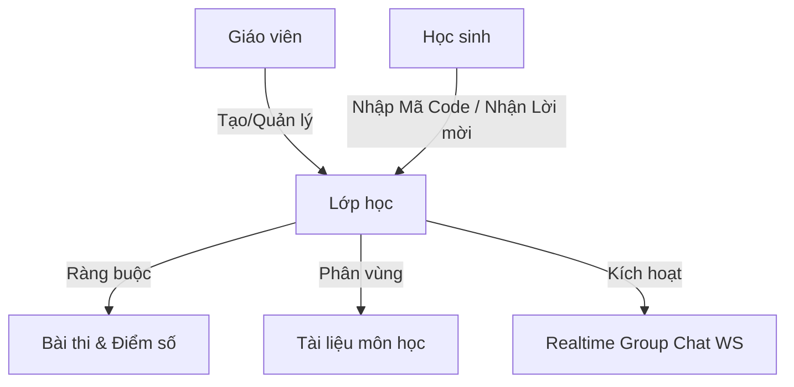

# Kế hoạch phát triển tính năng Lớp Học (Classrooms Module) - AuraAcademic

> **Bản kế hoạch chi tiết về thiết kế cơ sở dữ liệu, kiến trúc API RESTful, giải pháp WebSocket Group Chat và thiết kế giao diện UI/UX cho phân hệ Quản lý Lớp học thời gian thực.**

---

## 🗺️ TỔNG QUAN HỆ THỐNG LỚP HỌC (CLASSROOMS OVERVIEW)
Phân hệ Lớp học đóng vai trò trung tâm liên kết 3 thực thể cốt lõi hiện có của dự án AuraAcademic: **Bài thi (Exams)**, **Tài liệu (Materials)**, và **Realtime Chat (WebSockets)**. 

Giáo viên có quyền kiểm soát toàn diện, học sinh được tiếp cận tài nguyên có chọn lọc, đồng thời tạo ra không gian cộng tác số hiện đại.



---

## 🗄️ GIAI ĐOẠN 1: THIẾT KẾ CƠ SỞ DỮ LIỆU (DATABASE SCHEMAS)

Sử dụng **MongoDB** (phù hợp với cấu trúc DB hiện tại của `AuraAcademic_BE`), ta sẽ định nghĩa một Collection mới và bổ sung các trường tham chiếu vào các Collection hiện có.

### 1. Collection `classrooms` (Tạo mới)
Lưu trữ thông tin cấu trúc lớp, danh sách thành viên và trạng thái chờ duyệt.
```json
{
  "_id": "ObjectId",
  "name": "Lớp Toán Giải Tích 1 - K21",
  "description": "Lớp học ôn tập và làm bài thi trắc nghiệm học phần Giải tích 1",
  "code": "MTH101", // Mã lớp duy nhất 6 ký tự
  "teacherId": "teacher_67890", // Liên kết User (Teacher)
  "teacherName": "Thầy Nguyễn Văn A",
  "studentIds": [
    "student_001",
    "student_002"
  ], // Học sinh đã tham gia chính thức
  "pendingStudentIds": [
    "student_003"
  ], // Học sinh đang chờ giáo viên phê duyệt (khi nhập Class Code)
  "createdAt": "ISODate"
}
```

### 2. Tích hợp thực thể hiện có
*   **Exams Collection**: Thêm trường `classroomId` (String, Optional). Nếu trường này khác null, bài thi chỉ hiển thị cho học sinh thuộc lớp đó và điểm số sẽ được tổng hợp riêng vào Gradebook của lớp.
*   **Materials Collection**: Thêm trường `classroomId` (String, Optional). Nếu được gán, tài liệu chỉ hiển thị cho các thành viên trong lớp.

### 3. Collection `classroom_messages` (Tạo mới)
Lưu trữ nội dung chat nhóm của từng lớp học.
```json
{
  "_id": "ObjectId",
  "classroomId": "class_12345",
  "senderId": "student_001",
  "senderName": "Trần Thị B",
  "senderRole": "student", // "student" | "teacher"
  "content": "Thưa thầy, thời gian làm bài thi thử số 2 là bao nhiêu phút ạ?",
  "timestamp": "ISODate"
}
```

---

## 🔌 GIAI ĐOẠN 2: THIẾT KẾ API & WEBSOCKET BROKER

### 1. Hệ thống RESTful API (`ClassroomController.java`)
Tất cả các Endpoint đều được bảo mật bằng `@PreAuthorize` và JWT Authentication.

| Phương thức | API Endpoint | Vai trò truy cập | Mô tả |
| :--- | :--- | :--- | :--- |
| **POST** | `/api/classrooms` | Teacher | Tạo lớp học mới (Tự động sinh mã Code duy nhất) |
| **GET** | `/api/classrooms/teacher` | Teacher | Lấy toàn bộ danh sách lớp học do giáo viên này giảng dạy |
| **GET** | `/api/classrooms/student` | Student | Lấy toàn bộ danh sách lớp học mà học sinh này đã tham gia |
| **GET** | `/api/classrooms/{id}` | All Auth | Lấy chi tiết lớp học (Thành viên, Tài liệu, Bài thi liên quan) |
| **POST** | `/api/classrooms/join` | Student | Gửi yêu cầu xin vào lớp bằng cách nhập `code` (Trạng thái: Pending) |
| **POST** | `/api/classrooms/{id}/invite` | Teacher | Thêm trực tiếp học sinh vào lớp bằng Email hoặc Mã sinh viên |
| **POST** | `/api/classrooms/{id}/approve/{studentId}` | Teacher | Phê duyệt học sinh từ danh sách chờ vào lớp chính thức |
| **POST** | `/api/classrooms/{id}/reject/{studentId}` | Teacher | Từ chối yêu cầu gia nhập của học sinh |
| **GET** | `/api/classrooms/{id}/analytics` | Teacher | Tổng hợp thống kê phổ điểm bài thi của các học sinh trong lớp |

### 2. Thiết kế Kênh Chat nhóm WebSocket (Realtime Group Chat)
Tận dụng hạ tầng WebSocket STOMP hiện tại trong dự án để cấu hình thêm Broker phân vùng theo lớp học:

*   **Destination gửi tin**: `/app/classroom.send`
*   **Topic lắng nghe**: `/topic/classroom/{classroomId}`
*   **Payload Tin nhắn**:
    ```json
    {
      "classroomId": "String",
      "senderId": "String",
      "senderName": "String",
      "senderRole": "String",
      "content": "String"
    }
    ```
*   *Luồng xử lý*: Khi nhận được tin nhắn nhóm tại `ChatController`, backend lưu vào Mongo Collection `classroom_messages` trước khi broadcast về `/topic/classroom/{classroomId}` cho toàn lớp.

---

## 🖥️ GIAI ĐOẠN 3: THIẾT GIAO DIỆN HỌC SINH & GIÁO VIÊN (UI/UX)

Áp dụng phong cách **Dark Mode Midnight Navy & Electric Cyan** chuẩn của hệ thống AuraAcademic.

### 🧑‍🏫 1. Giao diện Giáo viên (Teacher Dashboard)
*   **Trang Danh sách Lớp học (`/teacher/classrooms`)**:
    *   Hiển thị dạng thẻ (Cards) 3D bóng bẩy với đường viền phát sáng (Glow Cyan border).
    *   Mỗi card hiển thị: Tên lớp, số lượng học sinh hiện tại, Mã lớp (Class Code) kích thước lớn nổi bật kèm nút copy nhanh.
    *   Nút bấm "Tạo lớp học mới" mở Modal nhập: Tên lớp, Mô tả ngắn.
*   **Trang Chi tiết Lớp học (`/teacher/classrooms/[id]`)**:
    *   Bố cục chia Tab hiện đại:
        1.  **Bảng tin (Stream)**: Đăng thông báo chung, giáo viên viết tin và đính kèm tài liệu học tập mới.
        2.  **Thành viên (People)**: Hiển thị 2 danh sách rõ ràng: Học sinh chính thức và Hàng chờ phê duyệt (đối với học sinh tự nhập mã Code) có nút Duyệt/Từ chối nhanh.
        3.  **Bài thi (Exams)**: Giao diện chọn bài thi hiện có trong kho để giao riêng cho lớp, đặt hạn chót làm bài (Due Date).
        4.  **Bảng điểm (Gradebook)**: Bảng thống kê điểm số trực quan, vẽ đồ thị hình cột phổ điểm bài thi thông minh.
        5.  **Group Chat**: Cửa sổ chat nhóm góc phải bên trong lớp để thảo luận trực tiếp với học sinh.

### 🧑‍🎓 2. Giao diện Học sinh (Student Dashboard)
*   **Trang Danh sách Lớp học (`/student/classrooms`)**:
    *   Grid chứa các lớp học sinh đã tham gia.
    *   Nút "Tham gia lớp học mới" (Join Class) nổi bật. Khi click mở Modal yêu cầu nhập **Mã lớp học (6 ký tự)**.
*   **Trang Chi tiết Lớp học (`/student/classrooms/[id]`)**:
    *   Bố cục tinh giản:
        1.  **Dòng thời gian (Timeline)**: Nơi nhận các thông báo mới nhất từ thầy cô.
        2.  **Tài liệu (Materials)**: Danh sách file tài liệu được chia sẻ riêng cho lớp, hỗ trợ xem trực tiếp hoặc tải về.
        3.  **Bài thi (Exams)**: Danh sách bài thi được giao kèm thanh tiến độ trạng thái (Đã làm - Điểm số / Chưa làm - Hạn chót).
        4.  **Group Chat**: Khung chat nhóm toàn lớp để trao đổi bài tập thời gian thực với các bạn cùng lớp.

---

## 🏁 PHASE X: TIÊU CHÍ KIỂM THỬ & NGHIỆM THU (VERIFICATION)

- [ ] **Mã lớp Duy nhất:** Hệ thống sinh mã lớp học ngẫu nhiên (6 ký tự) không trùng lặp và không lộ thông tin bảo mật.
- [ ] **Duyệt thành viên đúng vai trò:** Học sinh tự nhập mã Code rơi vào trạng thái `pendingStudentIds` và không thể xem tài liệu/bài thi của lớp cho đến khi Giáo viên nhấn nút "Duyệt".
- [ ] **Bảo mật phân quyền:** Học sinh lớp A hoàn toàn không thể truy cập tài liệu/bài thi của lớp B (Kể cả khi cố tình nhập URL trực tiếp có ID).
- [ ] **Realtime chat nhóm:** Tin nhắn gửi đi trên WebSocket được phát tán tới mọi học sinh trong lớp học đó tức thời (dưới 150ms) và không bị lag/nhầm sang lớp học khác.
- [ ] **Gradebook chính xác:** Điểm số các bài thi được gán riêng cho lớp được tính toán thống kê chính xác tuyệt đối, vẽ biểu đồ phổ điểm mượt mà.
